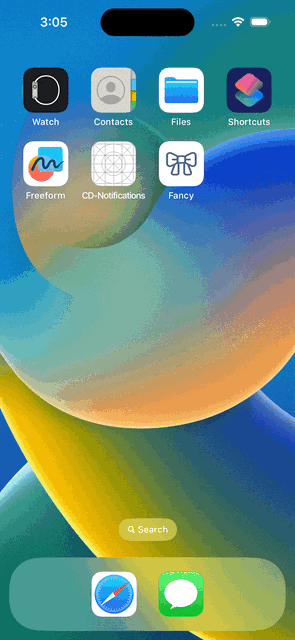
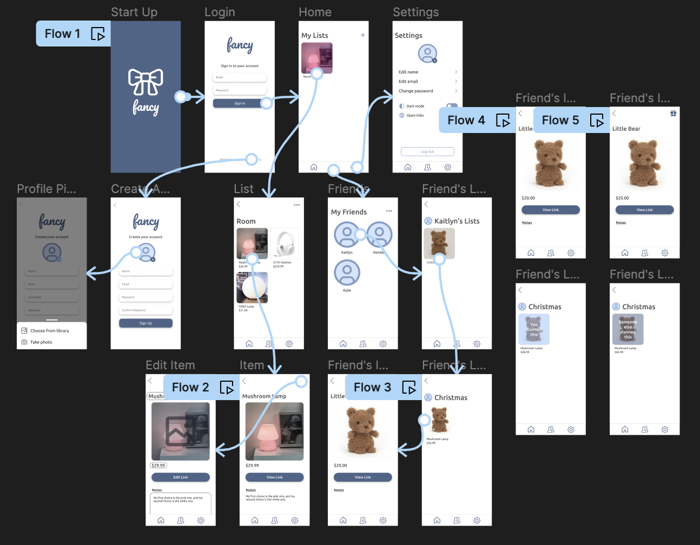

# Fancy

Fancy is a wishlist application that allows you to create and share wishlists with your family and friends. The application hopes to improve on organization and communication issues that can occur when it comes to gift-giving. No more having to keep multiple tabs of the things you want, texting people links that they have to keep track of, and wondering what to buy someone else. With Fancy, you will be able to create an account to store your wants in one place and share them too. When adding an item, besides having the option to add a url, you will be able to give the item a name, picture, and price so that people are able to see the important details of the item without having to load up the link. You can group your wants into lists/categories that you name to help keep the items organized. Friends and family members can be added to your friends list so that you are able to see each other’s wishlists. The app helps to streamline the gift-giving process by allowing your friends and family to “claim” items that they want to give to you so that people are not buying you the same things. You will not be able to see which items have been claimed, but everyone else who has access to your lists will. This is to ensure that there is still somewhat of the element of surprise that many people hope to have when gifting something. If someone wants to get you something that is a complete surprise instead of something off of your wishlist, Fancy can still be of use to them as they can refer to your wishlist for gift inspiration. So, what do you Fancy?

<table>
  <tr>
    <td> Login </td>
    <td> Home </td>
    <td> Friends </td>
    <td> Settings </td>
  <tr>
    <td>  </td>
    <td>  </td>
    <td>  </td>
    <td>  </td>
  </tr>
</table>

## Mockup

This is the mockup that I designed prior to the development of my app. Some changes were made to the original design, but most of the features remain the same.

## Features
- Firebase Authentication login/register path
- Realtime Database user data storage
- User profile path using camera and photo library
- Settings: toggle dark mode, toggle where links will open, edit profile
- Alerts
- User Defaults
- Gesture Recognition
- View Types include: text view, switch, segmented controller, bars, bar buttons
- View Controllers include: collection view, tab view controller

## Requirements
- Swift 5
- Xcode 14.3.1
- Packages: Firebase

## Test Accounts
- Test account 1: 
  - Email: kelly@gmail.com
  - Password: kellykelly
  - Friend Code: ucCZ38cRbSTDrcl3QOsvu0PCHOw2
- Test account 2:
  - Email: alex@gmail.com
  - Password: alexalex
  - Friend Code: rLMsaO3ysxZZDOn7sHS7WyxiyWC3
- Test account 3:
  - Email: kylie@gmail.com
  - Password: kyliekylie
  - Friend Code: jOFf0kr0IkQDbrfDzBH2Wyabfm33

